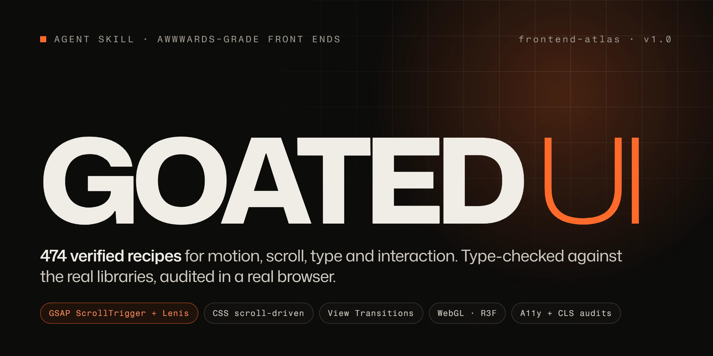
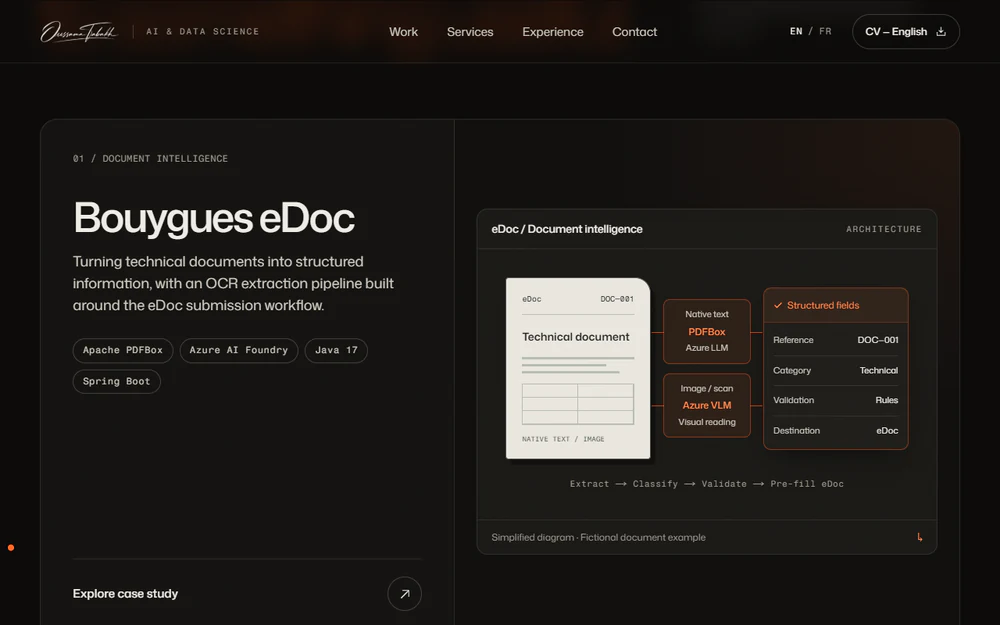
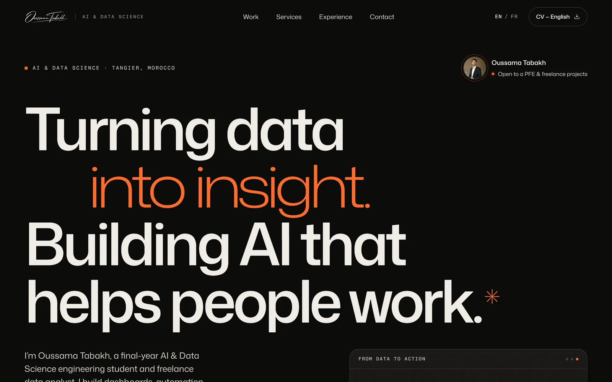
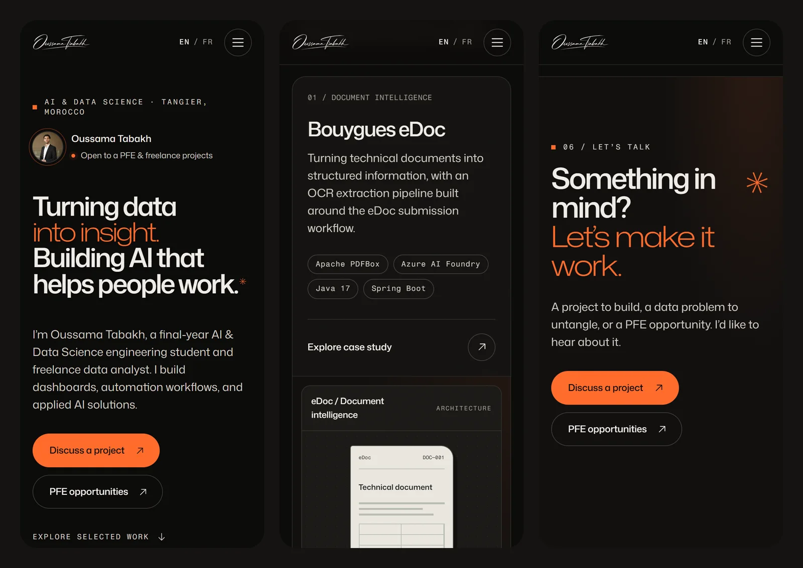

<p align="center">
  
</p>

<p align="center">
  <a href="LICENSE"></a>
  
  
  
</p>

<p align="center">
  <a href="https://github.com/flash-hero/GOATED-UI-SKILL/stargazers"></a>
  <a href="https://github.com/flash-hero/GOATED-UI-SKILL/actions/workflows/validate.yml"></a>
  
</p>

<h3 align="center">🐐 Turn your coding agent into an Awwwards-grade front-end engineer.</h3>

<p align="center">
  GOATED UI ships <b>frontend-atlas</b>, an agent skill that knows <i>how</i> to build the motion, scroll, type and interaction<br>
  you see on award-winning sites. Code type-checked against the real library versions. Signature effects run and audited in a real browser.
</p>

<p align="center">
  <a href="#install">Install</a> ·
  <a href="#showcase">Showcase</a> ·
  <a href="#how-it-works">How it works</a> ·
  <a href="#whats-inside">What's inside</a> ·
  <a href="#audit-it-in-a-real-browser">Audit scripts</a> ·
  <a href="#faq">FAQ</a>
</p>

---

## Why GOATED UI

Most design skills tell your agent what looks good. This one is the implementation layer: copy-pasteable recipes for the effects that ship on the best sites in 2026, plus the judgment to pick the right one and tune it until it feels inevitable.

- **Verified, not vibes.** Every TS/TSX recipe type-checks against pinned versions: gsap 3.15, @gsap/react 2.1, motion 13.4, lenis 1.3, three r186, @react-three/fiber 9.8, drei 10.7, animejs 4.5, tailwindcss 4.3, next 16.3 and react 19.3. The signature recipes were run in Chromium and audited.
- **Measured facts, not folklore.** A default GSAP `pin: true` measured a layout shift of 0.75 at the pin and 1.0 at the unpin per 100vh section in Chromium. CSS `position: sticky` with a scrubbed timeline measured 0. The skill knows which one to reach for, and says why.
- **Judgment built in.** A five-line Design Read before any code, a lightest-tool-first stack rule (CSS, then Motion, then GSAP + Lenis, then WebGL), a page choreography budget and a list of motion slop to refuse.
- **Accessible by default.** Reduced motion that keeps every piece of content, pointer effects gated to fine pointers, no content hidden behind loaders, pause controls for anything that moves longer than five seconds, and cleanup rules for every timeline, observer and WebGL context.
- **Ships its own QA.** `motion-audit.mjs` scrolls your page with real wheel input and reports layout shift with the shifting nodes, frame pacing, long animation frames, overflow culprits and reveals that never fired, in normal and reduced-motion runs.
- **Light on context.** A 250-line router (`SKILL.md`) plus an index of 474 anchored recipes. Your agent opens only the section it needs from about 28,000 lines of references.

## Showcase

This portfolio was redesigned end to end with GOATED UI: stacked project panels on CSS sticky with a scrubbed scale (no layout shift), a signature intro that starts writing on first paint, split-line headings, a route curtain, and complete reduced-motion and no-JavaScript fallbacks. Lab numbers after the redesign: largest contentful paint 0.12 to 0.65 s, cumulative layout shift 0.

<p align="center">
  
</p>

<p align="center">
  
</p>

<p align="center">
  
</p>

<p align="center"><sub>Portfolio of Oussama Tabakh, built with this skill.</sub></p>

## Install

### Claude Code (plugin marketplace)

```text
/plugin marketplace add flash-hero/GOATED-UI-SKILL
/plugin install goated-ui@goated-ui-skill
```

Restart Claude Code. The skill loads as `goated-ui:frontend-atlas` and activates on its own for UI work.

### Any agent (Claude Code, Cursor, Codex, Gemini CLI, GitHub Copilot, OpenCode and 70+ more)

```bash
npx skills add flash-hero/GOATED-UI-SKILL
```

The [skills CLI](https://github.com/vercel-labs/skills) detects the agents on your machine and installs the skill into each one.

### Manual

macOS and Linux:

```bash
git clone https://github.com/flash-hero/GOATED-UI-SKILL.git
cp -r GOATED-UI-SKILL/skills/frontend-atlas ~/.claude/skills/
```

Windows (PowerShell):

```powershell
git clone https://github.com/flash-hero/GOATED-UI-SKILL.git
Copy-Item -Recurse GOATED-UI-SKILL\skills\frontend-atlas "$HOME\.claude\skills\"
```

For a single project, copy the folder into that project's `.claude/skills/` instead.

## Usage

The skill activates by itself when you build, style, animate or redesign UI. You can also call it by name: *"Use frontend-atlas to..."*

Prompts it was made for:

```text
Make this landing page feel premium. Scroll animations, but nothing cheesy.
Add a stacked project section like the ones on Awwwards, with no layout shift.
Smooth scroll with Lenis and a pinned hero that zooms into the product shot.
Reveal the headline line by line, and keep it accessible to screen readers.
Page transitions between routes in Next.js.
A shader gradient background with a static fallback for weak devices.
Pick a visual direction for a developer portfolio and give me the tokens.
Audit the motion on localhost:3000 at desktop and mobile widths.
```

## How it works

1. **Design Read first.** Five lines, no more, before any code:

   ```text
   Direction:           one of 30 aesthetic directions, or a named blend of two
   Motion personality:  one of 7 presets (Swiss precise, luxury slow, editorial cinematic...)
   Signature moment:    the ONE effect a visitor will remember, and where it lives
   Supporting layer:    one reveal system + hover/press/focus feedback + transitions
   Stack:               CSS-native | Motion | GSAP + Lenis | + OGL/R3F, and why
   ```

2. **Find the recipe** in the effect shortlist or `references/INDEX.md`.
3. **Open only that section.** Reference files run roughly 600 to 3,000 lines; the agent never loads them whole.
4. **Tune** durations, easing, distance and stagger to the chosen motion personality.
5. **Verify in a real browser** with the audit script. Not watched means not done.

## What's inside

| Reference | Recipes | Covers |
|---|---:|---|
| `motion-principles.md` | 21 | Easing and duration tokens, springs, stagger, choreography, 7 motion personality presets |
| `scroll-gsap.md` | 20 | Lenis on the GSAP ticker, ScrollTrigger reveals, pinning, scrub, horizontal galleries, stacked cards, image sequences, Flip, Observer slides |
| `scroll-css-native.md` | 25 | Zero-JS scroll effects with `animation-timeline`, progress bars, reveals, parallax, CSS carousels, `scroll-state()` queries, fallbacks |
| `text-effects.md` | 31 | SplitText reveals, scramble, rotating words, text roll, variable-font play, marquees, counters, fitted wordmarks, kinetic intros |
| `interactions.md` | 16 | Custom cursor, magnetic elements, hover reveals, image trail, button systems, tilt, spotlight cards, tabs, drawers, micro-feedback |
| `page-transitions.md` | 25 | View Transitions, React `<ViewTransition>` in Next 16, shared elements, GSAP curtains, Swup, Barba, Astro, preloaders, menus |
| `backgrounds-svg-canvas.md` | 40 | Mesh, aurora, grain and grid backgrounds, conic borders, SVG draw, morph and goo, canvas particles, flow fields, Lottie vs Rive |
| `webgl-shaders-3d.md` | 30 | WebGL loading shell, GLSL shader library, image distortion, DOM-to-WebGL galleries, fluid cursor, particles, R3F glass hero, globes, WebGPU |
| `component-recipes.md` | 67 | Named components from 21st.dev, Aceternity, Magic UI, React Bits, Motion Primitives and Cult UI: install commands, self-owned code, overuse scores |
| `css-modern.md` | 32 | `@starting-style`, dialog and popover, anchor positioning, `@property`, container and style queries, `:has()`, `text-wrap`, Tailwind v4 mapping |
| `typography.md` | 17 | Type scale, fluid type, tracking, OpenType, 27 font pairings with sources and licences, loading without layout shift |
| `color-surfaces.md` | 25 | OKLCH ramps, semantic tokens, WCAG and APCA contrast, dark mode without flash, gradients, glass and liquid glass, shadows |
| `layout-composition.md` | 19 | Breakout grid, subgrid, fluid space, 10 hero skeletons, bento done right, sticky and overlap layouts, navigation |
| `aesthetic-directions.md` | 30 | 30 visual directions, each with tokens, fonts, motion signature, real reference sites and AI-slop tells |
| `libraries.md` | 37 | 37 libraries compared: size, install, SSR caveats, maintenance status, recommended stacks per project type |
| `performance-a11y.md` | 24 | Property cost, jank debugging, pausing offscreen work, layout shift from pins, reduced motion done right, WCAG motion criteria |
| `inspiration-sources.md` | 15 | Where to find references, components, fonts, icons and assets, and how to reverse-engineer an effect from a live site |

<details>
<summary><b>The effects people ask for most</b></summary>

- Smooth scroll with Lenis driven by the GSAP ticker
- Reveal on scroll with zero JavaScript
- Headline line-mask reveal with SplitText
- Pinned hero zoom and clip expansion
- Horizontal scroll gallery, in GSAP and in pure CSS
- Stacked cards and sticky split scrollytelling
- Words that light up as you scroll
- Scroll-velocity skew and marquees
- Apple-style image sequence and video scrub
- Route transitions in Next 16, shared elements, curtain overlays
- Preloader with a gated hero intro that skips on repeat visits
- Custom cursor, magnetic buttons, spotlight card grids
- Mesh gradients, aurora, grain, border beams, SVG line drawing
- Shader gradient backgrounds, fluid cursor, particle morphs, 3D glass hero, globes
- Bento grids, OKLCH palettes from one brand color, dark mode without a theme flash, liquid glass

</details>

## Audit it in a real browser

The audit scripts live in `skills/frontend-atlas/scripts/`. They need Node 18+, `playwright-core` (or `playwright`) in the project you audit, and an installed Chrome or Edge (or `AUDIT_BROWSER` pointing at a Chromium executable).

```bash
npm i -D playwright-core
node <skill-dir>/scripts/motion-audit.mjs http://localhost:3000 --out motion-audit --widths 1440,390 --steps 16
node <skill-dir>/scripts/contact-sheet.mjs motion-audit --match motion-1440-scroll
```

`<skill-dir>` is wherever the skill is installed, for example `~/.claude/skills/frontend-atlas`.

The audit scrolls with real wheel input, so Lenis and ScrollTrigger react as they would for a visitor, then runs again with `prefers-reduced-motion: reduce`. It reports console errors, horizontal overflow with the culprit element, content that entered the viewport but never became visible, layout shift with the nodes that moved, frame pacing and long animation frames. The contact sheet turns every scroll step into one image, so the choreography can be read at a glance.

## Recommended companions

GOATED UI decides *what to build and how*. These skill packs go deeper on single APIs and on taste, and frontend-atlas knows how to hand off to them:

| Pack | Install | Role |
|---|---|---|
| [GSAP official skills](https://github.com/greensock/gsap-skills) | `npx skills add greensock/gsap-skills` | Deep GSAP API reference |
| [Vercel agent skills](https://github.com/vercel-labs/agent-skills) | `npx skills add vercel-labs/agent-skills --skill web-design-guidelines --skill vercel-react-best-practices --skill vercel-react-view-transitions` | Final interface review, React and Next performance, `<ViewTransition>` patterns |
| [Taste Skill](https://github.com/Leonxlnx/taste-skill) | `npx skills add Leonxlnx/taste-skill --skill taste-skill --skill redesign-skill --skill soft-skill` | Taste and anti-slop direction |
| [Impeccable](https://github.com/pbakaus/impeccable) | `npx skills add pbakaus/impeccable` | Critique, audit and polish |

Precedence: your project's rules come first, then this skill's stack decision, then a companion's default.

## Repository layout

```text
GOATED-UI-SKILL/
├── .claude-plugin/
│   ├── marketplace.json        Claude Code marketplace listing
│   └── plugin.json             Plugin manifest
├── skills/
│   └── frontend-atlas/
│       ├── SKILL.md            The router: workflow, stack choice, rules, shortlist
│       ├── references/         17 reference files + INDEX.md (474 anchored recipes)
│       └── scripts/            motion-audit, contact-sheet, maintenance tools
├── assets/                     Banner and showcase images
└── .github/workflows/          Validation on every push
```

## FAQ

<details>
<summary><b>Does it only work with GSAP?</b></summary>

No. It picks the lightest tool that can express the effect: CSS first (scroll-driven animations, `@starting-style`, `@property`), Motion for React app UI, GSAP with ScrollTrigger and Lenis for scroll storytelling, and WebGL only when the concept needs it. Your project's rules always win: a project that is "CSS only" stays CSS only.
</details>

<details>
<summary><b>Will it fill my agent's context?</b></summary>

No. `SKILL.md` is a short router. The agent searches `references/INDEX.md`, then opens only the section it needs.
</details>

<details>
<summary><b>Which frameworks does it cover?</b></summary>

React and Next.js first (App Router, React 19, `<ViewTransition>`), with vanilla JavaScript recipes throughout, Astro, Swup and Barba for multi-page sites, and Tailwind v4 mappings for the modern CSS recipes.
</details>

<details>
<summary><b>Is it opinionated?</b></summary>

Yes, on purpose. It refuses fade-up-on-everything, bounce easing on UI, purple-to-blue aurora defaults, custom cursors on content sites and preloaders that only show a counter, and offers the tasteful variant instead.
</details>

<details>
<summary><b>How current is it?</b></summary>

Library versions and browser facts were verified on 2026-09-27 and are written into the skill, so your agent knows what was checked and when. See the [changelog](CHANGELOG.md).
</details>

## Contributing

Recipes are welcome when they are verified: type-checked against a pinned version, run in a browser and audited. See [CONTRIBUTING.md](CONTRIBUTING.md).

## Credits

Created by [Oussama Tabakh](https://github.com/flash-hero). Library, framework and component names belong to their owners; components from 21st.dev, Aceternity UI, Magic UI, React Bits, Motion Primitives and Cult UI are credited in `component-recipes.md` and keep their own licences when you install them. README structure inspired by [ui-ux-pro-max-skill](https://github.com/nextlevelbuilder/ui-ux-pro-max-skill).

## License

[MIT](LICENSE)

## Star history

<a href="https://star-history.com/#flash-hero/GOATED-UI-SKILL&Date">
  
</a>
